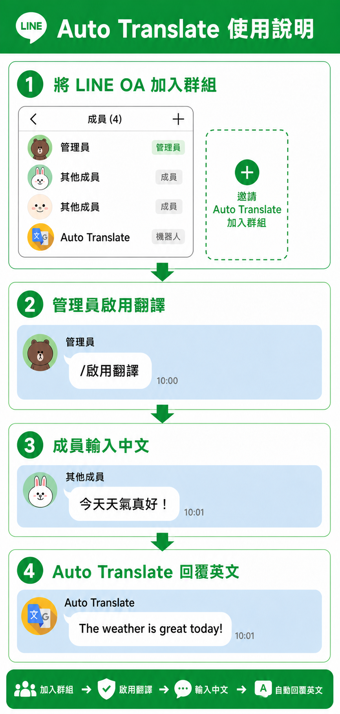

# LINE 群組中英自動翻譯機器人

LINE OA 中英翻譯：OA 被加入群組後預設不翻譯，指定授權者啟用後，會將群組內的中文文字翻譯為英文；群組或一對一聊天室收到語音時則先轉為文字，若逐字稿含中文，再同時回覆中文逐字稿與英文翻譯。

- 正式環境狀態：✅ 已部署並完成 LINE 群組端對端驗收（2026-08-12）

## 技術組合

- Firebase Functions 第 2 代（Node.js 22／TypeScript）
- LINE Messaging API
- Google Cloud Translation API v3
- Google Cloud Speech-to-Text API v2
- Cloud Firestore
- Vitest

## 本機開發

需求：Node.js 22、Firebase CLI，以及可用的 Firebase／Google Cloud 專案。

```powershell
npm.cmd install --prefix functions
npm.cmd run verify
```

`verify` 會依序執行 TypeScript 型別檢查、自動化測試與正式建置；Firebase 部署前也會自動執行相同檢查，任何一步失敗即停止部署。

若要使用 Firebase Emulator，複製 `.firebaserc.example` 為 `.firebaserc` 並填入專案 ID，再複製 `functions/.secret.local.example` 為 `functions/.secret.local` 並填入測試憑證：

```powershell
firebase.cmd emulators:start --only functions
```

`.firebaserc` 可依團隊需求提交；`.secret.local`、`.env*` 與實際 Secret 不可提交。

## 雲端設定與部署

1. 建立 Firebase 專案，升級 Blaze Plan，啟用 Cloud Translation API 與 Cloud Speech-to-Text API，並建立預設 Cloud Firestore database。
2. 將 Firebase 專案 ID 寫入 `.firebaserc`。
3. 將執行 Cloud Function 的服務帳戶授予 Translation API、Speech-to-Text 與 Firestore 所需的最小權限（`roles/cloudtranslate.user`、`roles/speech.client` 與 `roles/datastore.user`）。
4. 設定 LINE Secret：

   ```powershell
   firebase.cmd functions:secrets:set LINE_CHANNEL_SECRET
   firebase.cmd functions:secrets:set LINE_CHANNEL_ACCESS_TOKEN
   firebase.cmd functions:secrets:set LINE_OWNER_USER_ID
   ```

5. 部署：

   ```powershell
   firebase.cmd deploy --only functions:lineWebhook
   ```

6. 將部署後的 `lineWebhook` URL 填入 LINE Developers Console，按下 Verify，啟用 Webhook，並開啟「Allow bot to join group chats」。

### 將 LINE OA 加入群組



若需要將 LINE OA 加入群組，請依照以下順序操作：

1. 前往 [LINE Official Account Manager 設定](https://manager.line.biz/account/@363xfurd/setting)，先將「接受邀請加入群組或多人聊天室」設定為接受。
2. 在目標 LINE 群組中邀請這個 LINE OA。OA 加入後預設不會翻譯群組訊息。
3. 完成加入群組後，再將「接受邀請加入群組或多人聊天室」設定為不接受，避免 OA 被邀請至未授權的群組。

### 啟用群組翻譯

只有 `LINE_OWNER_USER_ID` 指定的授權帳號可啟用群組翻譯。請在目標群組輸入：

```text
/啟用翻譯
```

Bot 回覆「已啟用中文翻譯」後，該群組的文字翻譯與語音轉文字才會開始執行：中文或中英混合文字會翻譯成英文；語音會先轉成逐字稿，逐字稿含中文時再附英文翻譯。啟用狀態會儲存在 Firestore，Function 重新部署或重啟後仍然有效。

### 停用群組翻譯

授權帳號請在要停用的群組輸入：

```text
/停用翻譯
```

Bot 回覆「已停用中文翻譯」後，該群組的文字翻譯與語音轉文字都會停止。各群組以 `groupId` 獨立儲存狀態，不會影響其他群組。

## 訊息處理規則

- **群組總規則：必須先由授權者輸入 `/啟用翻譯`，文字翻譯與語音轉文字才會執行；輸入 `/停用翻譯` 後兩項功能都停止。**
- OA 初次加入群組時預設未啟用；群組啟用狀態以 `groupId` 儲存在 Firestore。
- 只有 `LINE_OWNER_USER_ID` 指定的帳號可輸入 `/啟用翻譯` 或 `/停用翻譯`。
- 任何群組成員可輸入 `/翻譯狀態` 查詢當前狀態。
- 一對一私訊 OA `/我的ID` 可取得自己的 webhook `source.userId`；此指令在群組中不生效。
- 一對一聊天室中的 LINE 語音不需要啟用指令，會直接轉成文字；逐字稿含中文時同時回覆英文翻譯。
- 只有已啟用群組的中文與中英混合文字會翻譯；未啟用群組與純英文不處理。
- 已啟用群組中的 LINE 語音會先轉成文字；逐字稿含中文時回覆「中文逐字稿 + 英文翻譯」，不含中文時只回覆逐字稿。
- 語音採同步辨識，預設只接受 59 秒以內且下載內容不超過 10 MB 的音訊。可在部署時以 `MAX_AUDIO_DURATION_MS` 與 `MAX_AUDIO_BYTES` 調整，但不可超過 Speech-to-Text 同步辨識的 60 秒／10 MB 上限。
- 外部來源音訊、圖片、貼圖、影片、檔案、系統事件及其他不支援的一對一訊息均不處理。
- 預設訊息長度上限為 2,000 個 JavaScript 字元，可在部署時以 `MAX_MESSAGE_LENGTH` 參數調整。
- 每次請求都以未修改的 raw body 驗證 `x-line-signature`。
- 單筆狀態讀寫、翻譯或回覆失敗時會寫入結構化日誌，Webhook 仍回傳 200，避免 LINE redelivery 造成重複回覆。

## 測試與檢查

```powershell
npm.cmd run verify
```

測試不會呼叫 LINE 或 Google Cloud，外部服務均使用 mock。目前共有 62 項測試。

