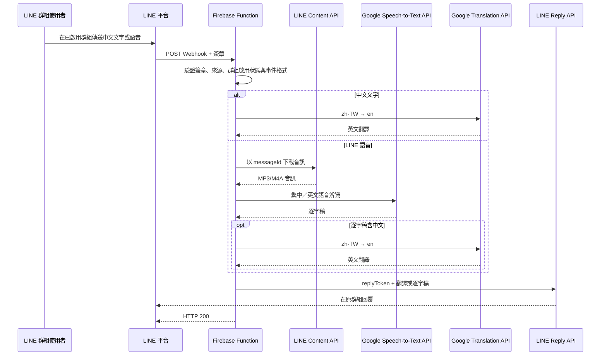

# 系統運作方式與架構說明

本專案是一個由 LINE 群組訊息觸發的無伺服器翻譯機器人；一對一聊天室只處理 `/我的ID`。Firebase Function 負責提供公開的 Webhook 網址、執行程式，以及管理部署、執行權限和 Secret；文字翻譯由 Google Cloud Translation API 完成，語音辨識由 Google Cloud Speech-to-Text API 完成。



## Firebase Function 是什麼？

可以把 Firebase Function 想像成：

> 一段部署在雲端、由特定事件喚醒的後端程式。

這個專案使用的是 HTTP 觸發方式。部署後，Firebase 會提供類似下面的網址：

```text
https://asia-east1-<project-id>.cloudfunctions.net/lineWebhook
```

LINE 平台將群組事件 POST 到這個網址，Firebase 才啟動 `lineWebhook` 處理請求。不需要自行準備伺服器、設定 Nginx 或讓 Node.js 程式永久執行。

入口定義在 [`functions/src/index.ts`](../functions/src/index.ts)：

```ts
export const lineWebhook = onRequest(...)
```

`export const lineWebhook` 的名稱也就是部署時使用的 Function 名稱。

## 一次訊息的完整處理過程

### 1. Firebase 接收 LINE Webhook

[`functions/src/index.ts`](../functions/src/index.ts) 設定了：

- 部署區域：`asia-east1`
- 記憶體：256 MiB
- 最長執行時間：60 秒
- 最多 5 個執行實例
- 專用 Google Cloud 服務帳戶
- 三個 LINE Secret

收到 HTTP request 後，它取出：

- HTTP method
- 未經修改的 `rawBody`
- `x-line-signature` header

然後交給 `processLineWebhook()`。

`index.ts` 可以視為「Firebase 接線層」；真正的商業邏輯主要在 `webhook.ts`。

### 2. 只允許 POST

[`functions/src/webhook.ts`](../functions/src/webhook.ts) 會先拒絕 GET 等其他方法：

```text
非 POST → HTTP 405
```

LINE Webhook 的正式事件會使用 POST。

### 3. 驗證請求真的是 LINE 發出的

程式使用 LINE Channel Secret，對完整的原始 request body 計算 HMAC-SHA256，再和 LINE 傳來的簽章比較。

實作位於 [`functions/src/signature.ts`](../functions/src/signature.ts)。

這也是為什麼程式必須使用 `request.rawBody`，不能先解析 JSON 再驗證：即使內容意思相同，只要空白、換行或字元編碼不同，簽章都可能改變。

```text
沒有簽章或簽章不符 → HTTP 401
```

### 4. 解析並篩選事件

簽章正確後，程式才會解析 JSON。群組內容只會在授權者啟用翻譯後處理；一對一聊天室只支援 `/我的ID`。支援：

- **群組共同閘門：`/啟用翻譯` 同時開啟文字翻譯與語音轉文字，`/停用翻譯` 同時關閉兩項功能。**
- 含中文、長度不超過預設 2,000 字元的群組文字。
- LINE 託管、預設不超過 59 秒與 10 MB 的群組語音。

事件型別判斷位於 [`functions/src/domain.ts`](../functions/src/domain.ts)，處理迴圈位於 [`functions/src/webhook.ts`](../functions/src/webhook.ts)。

| 收到的內容 | 行為 |
|---|---|
| 群組中文 | 翻譯並回覆 |
| 群組中英混合 | 翻譯整句並回覆 |
| 純英文 | 忽略 |
| 群組中文語音 | 回覆中文逐字稿與英文翻譯 |
| 群組非中文語音 | 只回覆逐字稿 |
| 一對一 LINE 語音 | 忽略，不下載、不辨識、不回覆 |
| 超過語音限制 | 回覆無法處理的提示 |
| 圖片、貼圖、影片 | 忽略 |
| 一對一一般文字 | 除 `/我的ID` 外皆忽略 |
| 超長訊息 | 忽略並記錄警告 |

這裡的「忽略」不是錯誤，只是不呼叫外部 API。

### 5. 呼叫 Google 語音辨識與翻譯

語音事件先由 [`LineMessagingApiContentLoader`](../functions/src/services.ts) 使用訊息 ID 從 LINE Content API 取得音訊，再由 [`GoogleCloudSpeechTranscriber`](../functions/src/services.ts) 呼叫 Speech-to-Text API v2。辨識器使用自動音訊格式偵測、繁體中文與英文候選語言，以及自動標點。

[`GoogleCloudTranslator`](../functions/src/services.ts) 呼叫 Cloud Translation API v3，明確指定：

```ts
sourceLanguageCode: "zh-TW",
targetLanguageCode: "en",
```

Google Cloud 專案 ID 由 Firebase 執行環境提供。Function 使用專用服務帳戶取得 Speech-to-Text 與 Translation API 權限，不需要把 Google 金鑰寫進程式碼。

### 6. 回覆到原本的 LINE 群組

翻譯完成後，[`LineMessagingApiReplier`](../functions/src/services.ts) 使用事件中的 `replyToken` 呼叫 LINE Reply API：

```ts
{
  replyToken,
  messages: [{type: "text", text: translatedText}],
}
```

`replyToken` 指定這次回覆要接在哪一個 LINE 事件後面，所以程式不需要自行保存群組 ID。

### 7. 回傳處理結果

同一個 Webhook 可能一次包含多個事件。程式逐筆處理並統計：

```json
{
  "ok": true,
  "processed": 1,
  "ignored": 2,
  "failed": 0
}
```

外部翻譯或 LINE 回覆失敗時，程式會寫錯誤日誌，但仍回傳 HTTP 200。這是刻意避免 LINE 重送整批事件、造成重複回覆。

代價是失敗訊息不會自動重試，也可能就此遺失；這是目前 POC 的取捨。

## Firebase 在這個專案中負責什麼？

Firebase Functions 在此負責：

1. 提供公開 HTTPS Webhook URL。
2. 在請求抵達時執行 Node.js 程式。
3. 注入 LINE Secret。
4. 讓程式以指定服務帳戶呼叫 Google Speech-to-Text、Translation API 與 Firestore。
5. 在 Firestore 保存各群組是否啟用翻譯。
6. 收集執行日誌、管理擴縮與逾時。

Firebase 沒有負責：

- 保存 LINE 訊息
- 保存翻譯結果
- 使用 Firebase Authentication
- 執行排程工作

除了群組啟用狀態外，不會保存訊息內容、音訊、逐字稿或翻譯結果。

## Secret 和一般設定的差別

[`functions/src/index.ts`](../functions/src/index.ts) 定義三個敏感值：

```ts
defineSecret("LINE_CHANNEL_SECRET")
defineSecret("LINE_CHANNEL_ACCESS_TOKEN")
defineSecret("LINE_OWNER_USER_ID")
```

- Channel Secret：驗證 LINE Webhook 簽章。
- Channel Access Token：呼叫 LINE Reply API。
- Owner User ID：限制哪些帳號可以啟用或停用群組翻譯。

它們存在 Google Secret Manager，不會寫進 Git。

另有三個非敏感參數：

```ts
MAX_MESSAGE_LENGTH
MAX_AUDIO_DURATION_MS
MAX_AUDIO_BYTES
```

未設定時分別預設為 2,000 字元、59,000 毫秒與 10,000,000 bytes。

## 專案檔案怎麼看

建議閱讀順序：

1. [`functions/src/index.ts`](../functions/src/index.ts)：Firebase 入口、執行環境與 Secret。
2. [`functions/src/webhook.ts`](../functions/src/webhook.ts)：整個 Webhook 處理流程。
3. [`functions/src/domain.ts`](../functions/src/domain.ts)：LINE 事件格式和篩選規則。
4. [`functions/src/signature.ts`](../functions/src/signature.ts)：LINE 安全簽章驗證。
5. [`functions/src/services.ts`](../functions/src/services.ts)：LINE 音訊下載、Google 語音辨識／翻譯和 LINE 回覆的外部 API 包裝。
6. [`functions/src/webhook.test.ts`](../functions/src/webhook.test.ts)：最容易理解系統預期行為的地方。

## 建置與部署發生了什麼？

原始碼使用 TypeScript，但 Firebase 實際執行 JavaScript。

```text
functions/src/*.ts
        ↓ npm run build
functions/lib/*.js
        ↓ firebase deploy
Firebase Function
```

[`functions/package.json`](../functions/package.json) 指定入口是 `lib/index.js`。

部署前，[`firebase.json`](../firebase.json) 會自動執行 `verify`，包括：

- TypeScript 型別檢查
- 自動化測試
- 正式建置

任何一項失敗，部署就會停止。

## 目前最重要的限制

- 只處理群組中文文字，以及已啟用群組中 59 秒內的 LINE 託管語音。
- 只保存群組啟用狀態，沒有訊息、逐字稿或翻譯歷史。
- 沒有 glossary，所以專有名詞可能翻得不理想。
- 沒有跨請求去重機制。
- API 失敗只寫日誌，不通知群組、不重試。
- 服務帳戶名稱寫死了專案名稱；若搬到另一個 Firebase 專案，需要修改。
- 目前最大 5 個 Function instances，可控制流量與成本，但高流量時也可能限制吞吐量。

完整部署與驗收方式請參考 [`POC 開發與部署指南.md`](./POC%20開發與部署指南.md)。依 [`專案日誌.md`](./專案日誌.md) 記錄，此 Function 已部署並完成 LINE 群組端對端測試。
